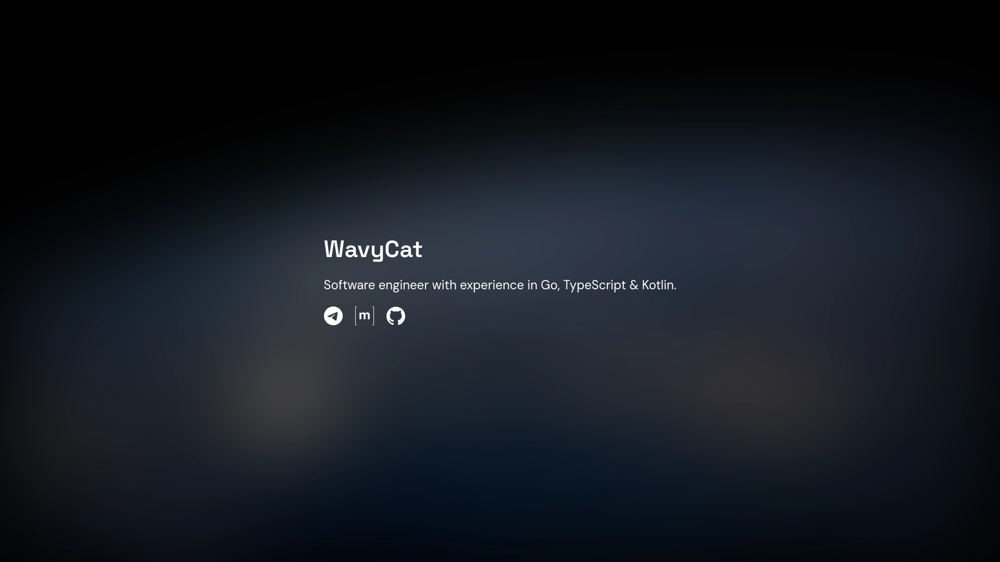

# WavyCat's Website

A personalized WavyCat's website. [View it](https://wavycat.me/)



## Stack


* **Runtime:** Bun
* **Framework:** Astro
* **Deployed on** Cloudflare Workers

## Getting started

### Run locally

```shell
bun run dev
```

### Deploy globally

[](https://deploy.workers.cloudflare.com/?url=https%3A%2F%2Fgithub.com%2Fwavy-cat%2Fwebsite)

```
bun run build && bun run deploy
```
