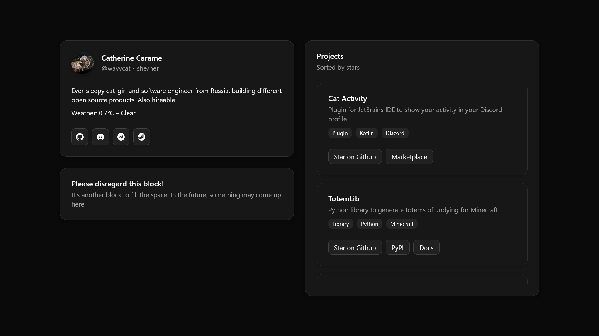

# WavyCat's Website

A personalized WavyCat's website. [View it](https://www.wavycat.ru/)



## Stack


* **Runtime:** Node.js 22
* **Package manager:** npm
* **Framework:** Next.js 15
* **UI library:** shadcn/ui
* **Compiled in** GitHub Actions
* **Deployed on** Cloudflare Pages

## Getting started

### Run locally

Create a `.dev.vars` file and write the secrets ([token from OWM](https://home.openweathermap.org/api_keys) and the city
whose weather should be requested) to the file:

```dotenv
OWM_API_KEY=Token_from_OpenWeatherMap
CITY_NAME=Your_city
```

Use `npm run dev` to start the Next.js server (`next dev`) or `npm run preview` to build the site (`next build`) and
start the Wrangler server (`wrangler pages dev`).

For now, there is no way (and no need) to merge these two servers together.

### Deploy globally

This section hasn't been written yet, but I think you should have no trouble figuring out such a small project on your
own (or at least asking LLM).

Let me tell you that you need to add secrets directly in the Cloudflare dashboard, and to deploy via GitHub Actions you
need to specify authorization data (API token and account ID) from Cloudflare in the Actions secrets.

Good luck!
